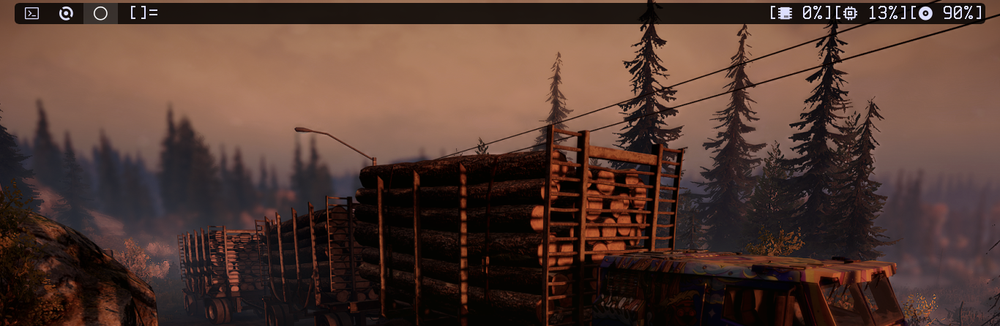

# DWM

### This is a fork of the suckless window manager DWM, with additional patches and Emoji compatibility.

# ALPHA_B build of DWM - dynamic window manager for X.



The [suckless window manager (dwm)](https://dwm.suckless.org/) with some additional
features that make it literally the best window manager in the Void:

## Bindings for:

+ So the modkey for this build of dwm is the ALT key.
+ To take a screenshot                ALT + f
+ Spawn a scratchpad                  ALT + s
+ New terminal                        ALT + Shift + Return
+ To start A programe using Dmenu     ALT + p

## Pretty stuff:

+ FlameShot to take screenshots with DWM.
+ Each patch offers a unique functionality to enhance your DWM experience.
+ DWM provides special features that no other window manager has, such as scratch pads.

## Patches:

+ All Tags Decoration
+ Alpha
+ Always Center
+ Attach Bottom
+ Bar Height
+ Full Gapps
+ No Title
+ Per Tag
+ Scratch Pad
+ Swallow
+ Under Line Tags
+ Vacant Tags

## Installation:

You should have xlib header and harfbuzz-devel files and noto-fonts-emoji installed.

```
git clone https://github.com/elbachir-one/dwm
cd dwm
make
sudo make clean install

```

`make` and `fontconfig` is required to build this.

## Dependences:

### Void Linux:

`sudo xbps-install -S xorg base-devel libXft-devel libX11-devel libXinerama-devel harfbuzz-devel noto-fonts-emoji xclip flameshot`

### Arch Linux:

`sudo pacman -Sy xorg base-devel noto-fonts-emoji harfbuzz xclip flameshot`

### Debian/Ubuntu:

`sudo apt install build-essential libx11-dev libxinerama-dev suckless-tools flameshot libxft-dev`

### FreeBSD:

`doas pkg install pkgconfig ncurses noto-fonts-emoji flameshot`

### OpenBSD:

`doas pkg_add pkgocnfig noto-fonts-emoji flameshot`

On OpenBSD, be sure to edit `config.mk` first and remove `-lrt` from the
`$LIBS` before compiling.

Be sure that you have a compositer like Picom or Compton running if you
want transparency.
